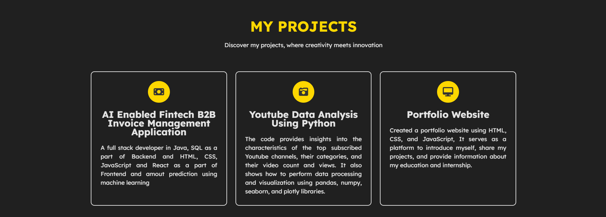

# Ashish Sahay's Portfolio

Welcome to my portfolio website! I'm Ashish Sahay, a passionate and aspiring software developer. This site showcases my skills, projects, education, and contact information.

## About Me
I'm a final-year Computer Science and Communication Engineering student at KIIT University. My expertise includes C, Java, SQL, and ReactJS. I enjoy learning and embracing new technologies.

## Education
- **B.Tech CSCE** - 85.1% (KIIT University, 2020-2024)
- **12th Science** - 68.4% (Vanijya International College, CBSE, 2019-2020)
- **10th** - 8.6 CGPA (DAV Public School, CBSE, 2016-2017)

## Internship Experience
- **Full-Stack Developer** (HighRadius, May - July 2023)
- **Salesforce Developer** (SmartInternz, May - July 2023)

## Projects
- **AI Enabled Fintech B2B Invoice Management Application**: Full-stack development with Java, SQL, HTML, CSS, JavaScript, React, and machine learning for amount prediction.
- **YouTube Data Analysis Using Python**: Insights into top YouTube channels using pandas, numpy, seaborn, and plotly.
- **Portfolio Website**: Built with HTML, CSS, and JavaScript.

## Contact
- **Email**: [ashish.789sahay@gmail.com](mailto:ashish.789sahay@gmail.com)
- **Availability**: Fulltime

Feel free to explore my work and get in touch!

